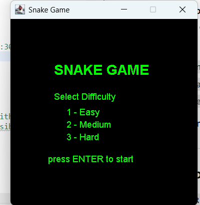
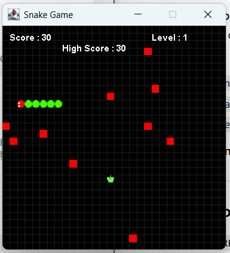
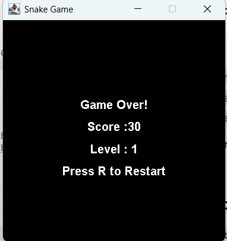

# 🐍 Snake Game (Java Swing)

A classic Snake Game built using Java Swing with modern features like sound effects, difficulty levels, and interactive UI.

---

## 🎮 Features

* 🟢 Smooth snake movement
* 🍎 Apple spawning system
* 🔊 Sound effects (eat, game over, menu)
* 🎯 Score tracking
* ⚡ Difficulty selection (Easy / Medium / Hard)
* 🚧 Obstacles in Hard mode
* 🎨 Grid system for better visuals
* ▶️ Start Menu
* 🔁 Restart game (Press **R**)

---

## 🛠️ Tech Used

* Java
* Java Swing (GUI)
* AWT Event Handling

---

## 🚀 How to Run

1. Clone the repository:
   git clone https://github.com/Swathishanmugasundaram/SnakeGame-Java.git

2. Open in Eclipse or any IDE

3. Run:
   SnakeGame.java

---

## 🎯 Controls

* ⬆️⬇️⬅️➡️ Arrow Keys → Move Snake
* R → Restart Game
* Enter → Start Game

---
## 📸 ScreenShots

### 🟢 Start Menu

### 🎮 Gameplay

### 💀 Game Over

---

## 💡 Future Improvements

* Pause functionality
* High score system
* Better animations

---

## 👩‍💻 Author

Swathi Shanmugasundaram
